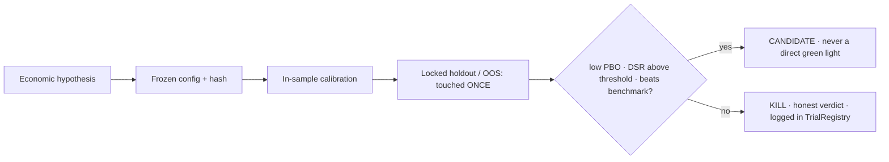

# Keystone — Empirical Asset-Pricing Research Framework

A research-grade Python framework for **systematic cross-asset signal research under formal
overfitting control**. It implements the López de Prado validation stack — Combinatorial Purged
Cross-Validation, the Deflated Sharpe Ratio, and the Probability of Backtest Overfitting — and uses
it to run a program of **~20 pre-registered experiments** on a survivorship-free, point-in-time
universe, each with success criteria fixed *before* the out-of-sample test and an honest verdict
recorded either way.

> **The research thesis on display:** in empirical asset pricing the hard part is not finding a
> signal that looks good in-sample — it is *not fooling yourself*. This project is built end-to-end
> around that problem: every hypothesis is economically motivated, pre-registered, tested once on a
> locked holdout, deflated against the cumulative number of trials, and **killed and documented if it
> doesn't survive.** Across the full program the honest finding is that no in-scope signal reliably
> beats a 60/40 on a risk-adjusted, net-of-cost, out-of-sample basis — consistent with the literature
> (and with SPIVA: ~90% of active managers don't either). Reporting that openly, rather than mining a
> backtest until it shines, is the core competency this repository demonstrates.

---

## 🔬 Research methodology

The validation framework is the heart of the project, implemented from primary sources:

| Control | What it does | Reference |
|---------|--------------|-----------|
| **Pre-registration** | `ExperimentConfig` frozen and hashed *before* the OOS run; ex-ante success criteria declared in code; changing a parameter creates a new experiment | — |
| **Deflated Sharpe Ratio** | Adjusts the observed Sharpe for non-normality **and the number of trials**, returning P(true SR > 0) | Bailey & López de Prado (2014) |
| **Probability of Backtest Overfitting** | CSCV: across combinatorial IS/OOS splits, measures how often the in-sample-best strategy underperforms out-of-sample ([`backtest/pbo.py`](jeanclaude/backtest/pbo.py)) | Bailey & López de Prado (2014) |
| **Combinatorial Purged CV** | Walk-forward validation with purging + embargo to remove label-overlap leakage ([`backtest/cpcv.py`](jeanclaude/backtest/cpcv.py)) | López de Prado, *AFML* ch. 7, 12 |
| **Cumulative trial counting** | `TrialRegistry` counts *every* trial across the whole program, so the DSR penalizes the entire search history — not just the current run | — |
| **Locked holdout / one-shot OOS** | Physical date split; the test set is touched once, after IS parameter choice, and never re-examined | — |
| **Honest reporting** | Every report states *all* ex-ante criteria (not only those passed) and a separate economic reading; a self-audit **killed an inflated Sharpe-0.97 tearsheet as survivorship bias** | — |

> 📚 Grounded in the canonical literature (full bibliography: [`alpha_generation.bib`](alpha_generation.bib)):
> López de Prado *AFML*; Bailey & López de Prado on DSR/PBO; Fama-French factor models;
> Jegadeesh-Titman & Moskowitz-Ooi-Pedersen (momentum/trend); Ang-Hodrick-Xing-Zhang & Baker-Bradley-Wurgler
> (low-vol anomaly); Gu-Kelly-Xiu (ML asset pricing); Kakushadze (101 Formulaic Alphas).

---

## 🧪 The research program (a public kill-log)



Each sprint is one economically-motivated hypothesis with a pre-registered verdict. The FAILs are the
point: a researcher's value is in correctly *rejecting* what doesn't hold up out-of-sample.

| Sprint(s) | Hypothesis | Verdict & economic reading |
|-----------|------------|----------------------------|
| **I–M** | Risk-managed allocation (HRP + trend + momentum, 20-ETF ex-ante universe); leverage; regime bands; structural floors | **Honest frontier**: Sharpe ~0.91–0.95 with much shallower drawdowns than SPY, but does **not** beat a 60/40 on Sharpe — the gap is allocation quality, not friction (no-trade band fails) |
| **N** | Point-in-time, survivorship-free S&P 500 data layer (joiner/leaver change-log + total returns incl. delisted) | ✅ **Validated** — exact year-end baskets (500/502/504), delisted RICs covered (LEH −78.6%, GM −96.9%) |
| **O** | Cross-sectional momentum (12-1) on the PIT universe | **FAIL** — CAGR 8.9% vs SPY 10.9%; winner–loser spread **t-stat 0.25** → the large-cap momentum premium is absent in this period |
| **P / Q** | News-sentiment (FinBERT) / fundamentals (value-quality) signals | Infeasible **as-is** — data licensing (P) and point-in-time restatement / delisted contamination (Q) |
| **R** | Low-volatility cross-sectional anomaly | **FAIL** — Sharpe 0.78 ≈ SPY 0.79 (beats 60/40 on CAGR, SPY on drawdown, but no risk-adjusted edge) |
| **S** | Trend/regime overlay on Micro E-mini futures (defensive convexity) | **Honest FAIL** — improves a 60/40's drawdown & Calmar historically, but the decorrelation **decays post-2011** and the standalone result is not statistically significant after deflation |
| **T** | **Disciplined formulaic mining**: N=54 returns-only alphas (operator grammar), PBO + locked 2016–2026 holdout + DSR(N) + per-year alpha-decay kill criterion | **KILL** (pre-declared as the likely outcome) — DSR 0.72 < 0.95, holdout Sharpe 0.845 < 1.018, RankIC decays. *Finding:* long-only top-decile portfolios are nearly all >0.7 correlated → the tradable returns-only signal space is effectively **~2-dimensional** |

📁 Per-sprint reports in [`docs/reports/`](docs/reports/) · feasibility notes in
[`docs/research/`](docs/research/) · every trial logged in [`data/research/trials.jsonl`](data/research/).

### Anti-overfitting diagnostics (Sprint T)

IS-vs-OOS Sharpe scatter, the PBO logit distribution, and per-year RankIC — the visual signature of
an honest search and its KILL verdict:


---

## 📊 Data integrity (often where research silently breaks)

The single-stock work runs on a **point-in-time, survivorship-free S&P 500 universe** reconstructed
from the index joiner/leaver change-log, with **total returns for delisted names included** (so a
2008 portfolio actually takes Lehman's −78.6%). This eliminates the survivorship and look-ahead bias
that invalidates the majority of retail equity backtests — and the project's own audit flagged an
earlier, biased tearsheet rather than shipping it. Multi-source ingestion (Refinitiv/LSEG, FRED,
Yahoo), Parquet storage, and NYSE-calendar alignment (phantom-row / missing-day handling) support it.

---

## 🏗️ Research infrastructure

The engineering exists to make the research *reproducible and trustworthy*: a modular package, **615
tests (TDD)**, immutable/idempotent state, GitHub Actions CI, and deterministic experiments
(config hash → registry → verdict). Reusable components include a walk-forward cross-sectional engine,
HRP & Black-Litterman optimizers, Ledoit-Wolf covariance, an HMM regime detector, and a forward-testing
paper-trading stack with health monitoring.

```
jeanclaude/
├── backtest/   # walk-forward engine, CPCV, DSR, PBO (CSCV), IC, cross_sectional, metrics
├── data/       # point-in-time constituents, total returns, multi-source ingestion, Parquet
├── portfolio/  # HRP, Black-Litterman, TrendMomentum, VolTarget, RegimeBand; Ledoit-Wolf cov
├── research/   # ExperimentConfig, TrialRegistry — the honest trial log
├── signals/    # formulaic/ (returns-only grammar) · macro/ (HMM) · news/ (FinBERT)
├── costs/      # Almgren-Chriss + per-contract micro-futures cost model
└── execution/  # idempotent paper trading (PaperBroker keyed by logical date)
```

---

## ⚙️ Tech stack

`pandas` · `numpy` · `scipy` · `statsmodels` · `cvxpy` · `scikit-learn` · `pomegranate` (HMM) ·
`transformers`+`torch` (FinBERT) · `lseg-data` · `yfinance` · `fredapi` · `pytest` · `uv`

## 🚀 Quickstart

```bash
git clone https://github.com/pancakes9798/Keystone.git && cd Keystone
uv sync && uv run pytest -q                        # 615 tests, ~11s — validation stack, engines, optimizers
uv run python scripts/backtest_sprint_m.py         # risk-managed multi-asset backtest on Yahoo total-return data
```

ETF-level studies run on Yahoo total-return data with **no credentials required**. The single-stock
experiments (Sprints N/O/T) rely on a **point-in-time, survivorship-free S&P 500 dataset reconstructed
from a licensed Refinitiv/LSEG feed**, which is not redistributed here — the engines, configs, trial
log, and per-sprint reports are included so the methodology is fully auditable.

---

## 📌 Honest conclusion

After ~20 pre-registered experiments, **no in-scope signal reliably beats a 60/40 on a risk-adjusted,
net-of-cost, out-of-sample basis** — which is what rigorous validation *should* find most of the time.
The durable value here is the research practice itself: a tested, reproducible, overfitting-aware
framework; a survivorship-free point-in-time dataset; and a demonstrated discipline of reporting what
the data actually says — including when it says *no*.

---

## 🤝 Acknowledgments

Point-in-time market-data access (Refinitiv/LSEG) was contributed by **Filippo** — it made the
single-stock, survivorship-free research feasible. Built with AI-assisted tooling (Claude Code).

<sub>For research and educational purposes only — not investment advice.</sub>
