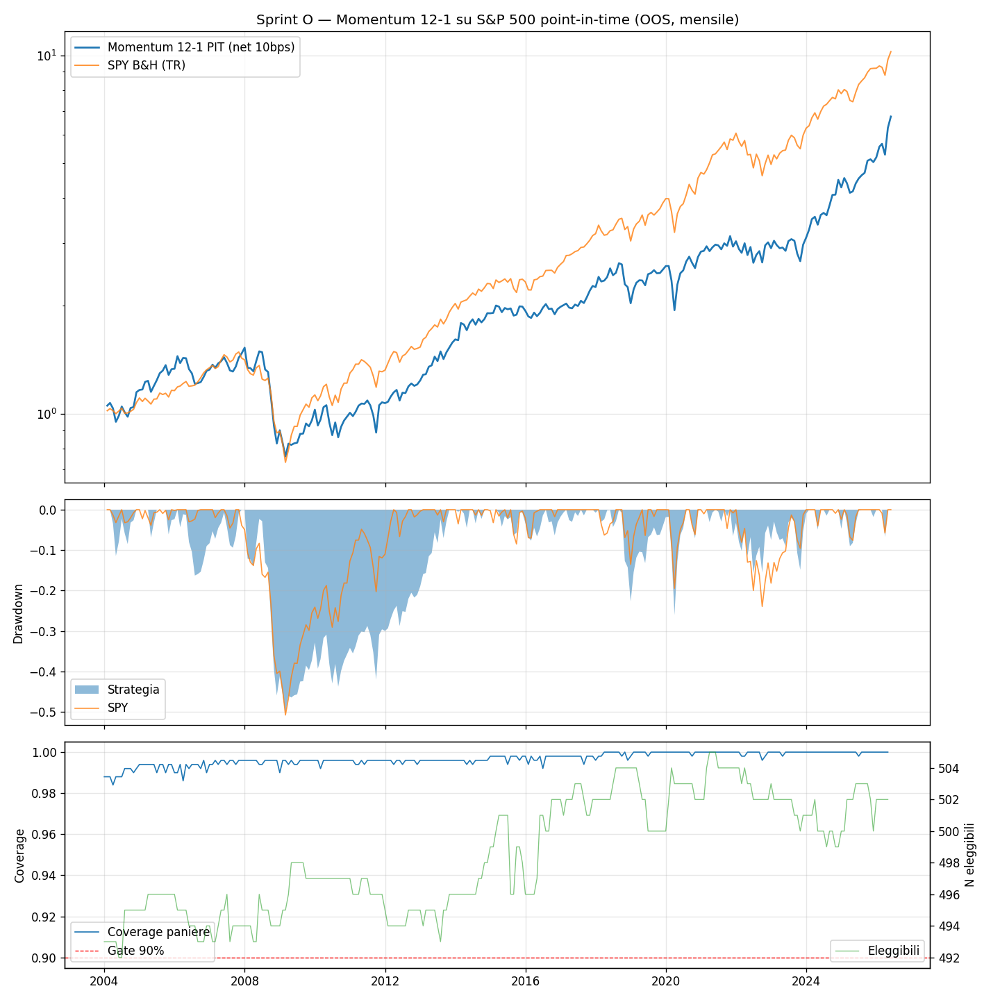

# Sprint O — Momentum 12-1 Cross-Sectional su Universo Point-in-Time

**Data run:** 2026-06-12  
**Config hash:** `234ec21a4cff9e29`  
**Trial cumulativi (DSR):** 43  
**Finestra OOS:** 2004-01 → 2026-05 (269 mesi)  

**Natura dell'esperimento:** validation gate della pipeline PIT (constituent JL IC=B + TR.TotalReturn1D), zero parametri liberi, spec e criteri congelati ex-ante nel piano `docs/superpowers/plans/2026-06-12-sprint-o-momentum-pit.md`.

---

## Gate dati (precondizione)

Coverage minima mensile: **98.4%** (mese peggiore: 2004-04) — soglia 90% → **PASS**

## Risultati OOS (mensile, net 10bps)

| | CAGR | Sharpe | Sortino | MaxDD |
|---|---|---|---|---|
| Momentum 12-1 PIT | +8.9% | 0.56 | 0.79 | -50.3% |
| SPY B&H (TR) | +10.9% | 0.79 | 1.07 | -50.8% |

**DSR** (n_trials=43, obs=269 mesi, skew=-0.25, kurt=4.48): **0.658**

## Verdetto sui criteri ex-ante

- **(a) CAGR ≥ CAGR_SPY − 2pt:** +8.9% vs +8.9% → **FAIL**
- **(b) MaxDD ≤ MaxDD_SPY:** -50.3% vs -50.8% → **PASS**

**VALIDATION GATE: FAIL**

Interpretazione dichiarata ex-ante: PASS ⇒ pipeline PIT validata, si procede con FinBERT cross-sectional e doppi sort. FAIL con gate dati OK ⇒ indagare la pipeline prima di concludere sul segnale.

## Diagnostica

- Membri medi del paniere: 502  
- Eleggibili medi (≥200 obs): 499  
- Nomi detenuti medi: 50  
- Mesi in cash (decile < 20 nomi): 0  
- Turnover medio annualizzato (one-way): 762%  
- Costo medio mensile: 6.3 bps  

*Script: `scripts/backtest_sprint_o.py` — spec congelata, un solo run OOS.*
---

## Diagnostica post-run (descrittiva — nessun nuovo trial, nessun verdetto modificato)

Il protocollo ex-ante prevede: FAIL con gate dati OK ⇒ indagare la pipeline prima di
concludere sul segnale. Tre diagnostiche descrittive sul run già eseguito:

**1. Margine del criterio (a):** CAGR 8.8921% vs soglia 8.9357% — **FAIL per 4 punti
base**. Non un crollo: un quasi-pareggio con SPY−2pt.

**2. Spread winners−losers (gross, D10−D1):** D10 CAGR 9.72% vs D1 5.49%, ma lo spread
mensile è **+0.108% con t-stat 0.25** (Sharpe 0.05) — il premio momentum cross-sectional
nell'S&P 500 2004-2026 è statisticamente indistinguibile da zero. Coerente con la
letteratura: decadimento del momentum nelle large cap dopo il 2000, crash del 2009,
decay post-pubblicazione (McLean-Pontiff).

**3. Benchmark equal-weight dell'universo (stesso processo, decile=100%):** CAGR 9.27%,
Sharpe 0.60, MaxDD −54.1% — il top-decile (8.89%, 0.56) gli sta attaccato, ed entrambi
sotto SPY cap-weight (10.94%, 0.79). Il gap vs SPY è l'effetto **equal-weight vs
cap-weight nell'era della concentrazione mega-cap** (2015-2026), non un artefatto.

## Lettura onesta

- **La pipeline PIT è VALIDATA**: coverage 98.4% minima su 269 mesi, panieri esatti al
  membro, date di borsa vere, delistati nel P&L (42% del paniere 2005), benchmark EW
  che replica il comportamento noto dei fondi equal-weight. Il deliverable
  infrastrutturale di Sprint N/O è solido.
- **Il segnale momentum 12-1 long-only nelle mega-cap USA non aggiunge nulla** nel
  periodo: verdetto ottenuto con UN trial, zero data mining, criteri congelati prima
  del run. Questo è il validation gate che funziona: una risposta onesta e definitiva
  a basso costo.
- **Implicazione per la Fase 2**: la caccia all'alpha cross-sectional si sposta sui
  segnali differenzianti previsti dal brief — FinBERT news sentiment per-ticker
  (l'edge dell'accesso Refinitiv news) e doppi sort momentum×sentiment — ciascuno con
  il proprio sprint ex-ante. Il costo del data layer è già pagato.

## Storia del run (trasparenza)

- **Tentativo 1 (2026-06-12 21:20): RUN INVALIDO** — gate coverage 73.2% < 90%.
  Causa: bug API Refinitiv (`get_data` con `Frq=D` ancora le date a SDate —
  ritorni ABNB post-IPO etichettati 2002-2008). Nessun trial registrato.
- **Fix:** `get_total_returns` riscritto su `get_history` (date vere), refetch
  completo, 561 test verdi. Commit `cd1a1a5`.
- **Tentativo 2 (2026-06-12 22:50): RUN VALIDO** — gate 98.4%, verdetto sopra.
  Unico trial registrato (hash `234ec21a4cff9e29`, n_trials cumulativo 43).
