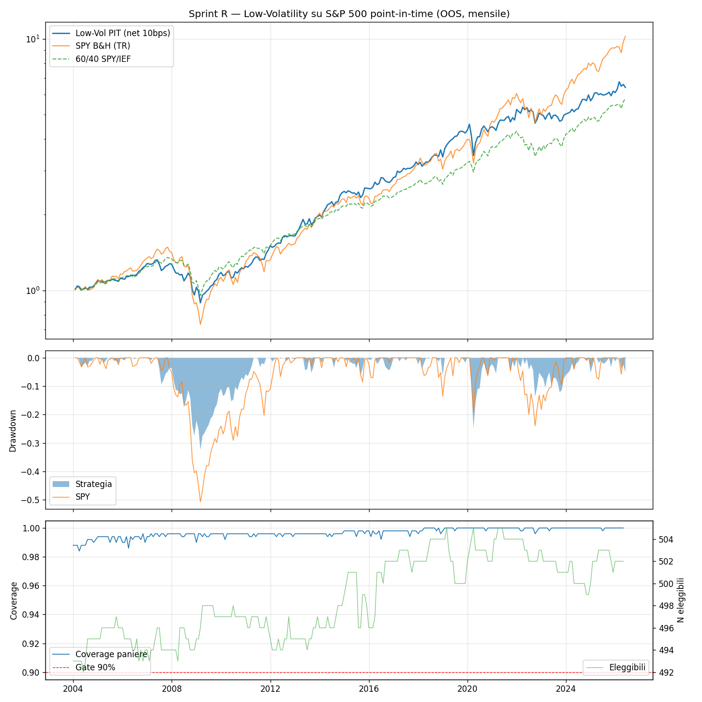

# Sprint R — Low-Volatility Cross-Sectional su Universo Point-in-Time

**Data run:** 2026-06-14  
**Config hash:** `1f30e59545d4c3db`  
**Trial cumulativi (DSR):** 44  
**Finestra OOS:** 2004-01 → 2026-05 (269 mesi)  

**Natura dell'esperimento:** test di segnale low-volatility cross-sectional long-only su universo S&P 500 point-in-time (JL IC=B). Pipeline PIT già validata in Sprint N/O. Spec congelata ex-ante: `docs/superpowers/specs/2026-06-14-sprint-r-low-vol-design.md`.

---

## Gate dati (precondizione)

Coverage minima mensile: **98.4%** (mese peggiore: 2004-04) — soglia 90% → **PASS**

## Risultati OOS (mensile, net 10bps)

| | CAGR | Sharpe | Sortino | MaxDD |
|---|---|---|---|---|
| Low-Vol PIT | +8.6% | 0.78 | 0.96 | -32.5% |
| SPY B&H (TR) | +10.9% | 0.79 | 1.07 | -50.8% |
| 60/40 SPY/IEF | +8.2% | 0.92 | 1.19 | -29.5% |

**DSR** (n_trials=44, obs=269 mesi, skew=-0.79, kurt=6.60): **0.902**

## Verdetto sui criteri ex-ante

- **(a) Sharpe ≥ Sharpe_SPY:** 0.78 vs 0.79 → **FAIL**
- **(b) MaxDD ≤ MaxDD_SPY:** -32.5% vs -50.8% → **PASS**
- **(c) CAGR ≥ CAGR_60/40:** +8.6% vs +8.2% → **PASS**

**VERDETTO: FAIL**

Interpretazione ex-ante: PASS ⇒ anomalia low-vol viva su questo universo, si costruisce sopra (combinare con bond verso il 60/40). FAIL con gate dati OK ⇒ verdetto onesto sul segnale.

## Diagnostica

- Membri medi del paniere: 502  
- Eleggibili medi (≥200 obs): 499  
- Nomi detenuti medi: 50  
- Mesi in cash (decile < 20 nomi): 0  
- Turnover medio annualizzato (one-way): 252%  
- Costo medio mensile: 2.1 bps  

*Script: `scripts/backtest_sprint_r.py` — spec congelata, un solo run OOS.*