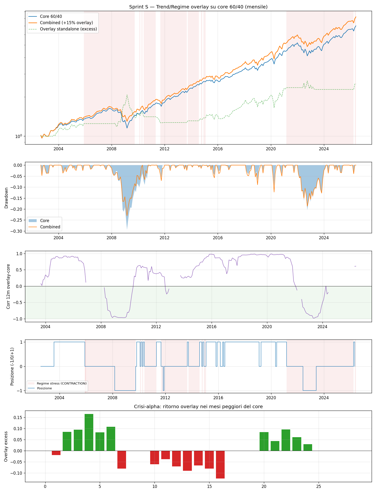

# Sprint S — Trend/Regime Equity-Index Overlay (convessita difensiva)

**Data run:** 2026-06-14  
**Config hash:** `6201fea0ac4f084f`  
**Trial cumulativi (DSR):** 45  
**Finestra:** 2002-08 -> 2026-05 (286 mesi)  

**BACKTEST-ONLY** — nessun broker/conto/denaro. Spec: `docs/superpowers/specs/2026-06-14-sprint-s-trend-overlay-design.md`.

## Criteri ex-ante (overlay-su-core, OVERLAY_FRAC=0.15)

- **(a) MaxDD(combined) < MaxDD(core):** -23.1% vs -29.5% -> **PASS**
- **(b) Calmar(combined) > Calmar(core):** 0.40 vs 0.29 -> **PASS**
- **(c) Overlay net >= 0:** +151.2% -> **PASS**
- **(d) corr <= 0 (full +0.01, stress -0.59):** -> **FAIL**

**VERDETTO (full): FAIL**  |  **sub-2011: FAIL**
  -  DSR overlay (n_trials=45): 0.369

Nozionale di core implicito per **1 MES** a OVERLAY_FRAC=0.15: ~~EUR 421.233~~ → **CORREZIONE: ~EUR 165-175k**. Il valore stampato dallo script (421k) è sovrastimato ~2.3x: `yf_spy_level` ricostruisce un indice a base-100 **total-return** (~1.250), non il livello SPX reale (~5.400). Il nozionale MES reale è 5×~5.400 ≈ $27k → core implicito per 1 MES @15% ≈ $180k (~€170k). La granularità sfavorevole resta vera, ma la soglia reale è ~2.3x più bassa.

## Metriche

| | CAGR | MaxDD | Calmar | overlay cum | corr full | corr stress |
|---|---|---|---|---|---|---|
| Combined full | +9.2% | -23.1% | 0.40 | +151.2% | +0.01 | -0.59 |
| Combined 2011+ | +10.3% | -18.7% | 0.55 | +78.3% | +0.29 | -0.22 |
| Core full | +8.5% | -29.5% | 0.29 | — | — | — |

## Lettura onesta (post-run, review adversariale)

Il verdetto è **FAIL** ed è registrato come tale: il criterio (d) `corr ≤ 0` è scattato
correttamente perché `corr_full = +0.009`. Nessun goalpost spostato. Tre caveat impediscono di
leggerlo come "FAIL su tecnicismo con storia forte" (sarebbe over-claiming):

1. **La diversificazione si sta DETERIORANDO nell'era moderna.** Sul full sample `corr_full ≈ 0`
   (+0.009) e `corr_stress = −0.59` — ottimo. Ma sul **sub-periodo 2011+** `corr_full = +0.29`
   (positiva!) e `corr_stress = −0.22` (molto più debole). Lo zero full-sample è trainato dalle
   crisi **pre-2011** (2000-02, 2008) dove l'overlay era genuinamente short/difensivo. Dal 2011
   la decorrelazione si è erosa — il caveat più importante per una decisione prospettica.
2. **DSR = 0.369 < 0.5**: dopo l'aggiustamento per 45 trial, il +151% cumulato dell'overlay NON è
   significativo come evidenza standalone di skill. I PASS su (a)/(b)/(c) possono riflettere un
   regime storico (le grandi crisi) più che un meccanismo robusto e persistente.
3. **`corr_full = +0.009` è statisticamente indistinguibile da zero** (SE≈0.06, IC95% ≈ [−0.11,
   +0.13]). Il criterio `≤ 0` stretto su una quantità rumorosa ha prodotto il FAIL: lezione
   metodologica (criterio (d) troppo stretto sul full-sample), ma il risultato NON è da relabelare.

**Sintesi onesta:** l'overlay ha migliorato il 60/40 storicamente su drawdown/Calmar/rendimento,
ma il beneficio difensivo è guidato dalle crisi pre-2011 e si sta erodendo, e non è statisticamente
robusto. È il più vicino a un overlay difensivo utile della serie, ma NON un via libera. Eventuale
follow-up = nuovo trial con criterio ri-formulato EX-ANTE (es. basato su corr_stress) + un
out-of-sample dichiarato — non un re-label di questo run.

*Script: `scripts/backtest_sprint_s.py` — spec congelata, un solo run OOS. BACKTEST-ONLY.*