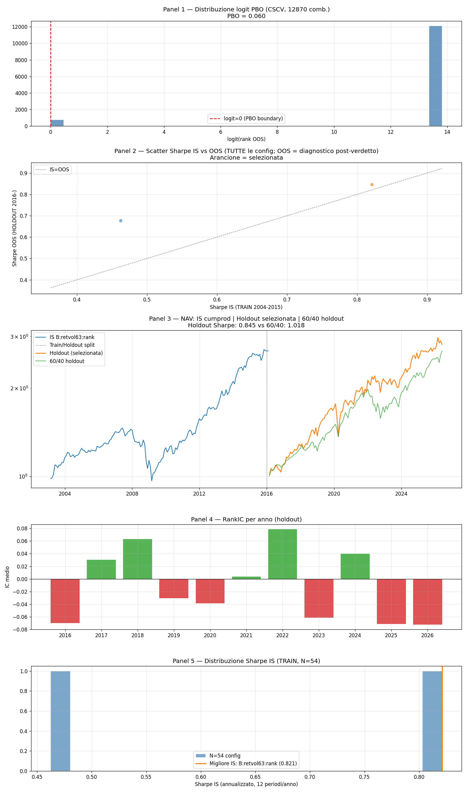

# Sprint T — Mining Formulaico Returns-Only Disciplinato

**Data run:** 2026-06-15  
**Config hash:** `577e8b9e70983b77`  
**Spec:** `docs/superpowers/specs/2026-06-15-sprint-t-disciplined-mining-design.md`  

**BACKTEST-ONLY** — nessun broker/conto/denaro reale.

---

## Framing onesto (dichiarato ex-ante)

Questo sprint è un esercizio di disciplina metodologica sul mining. L'esito probabile è **KILL**: lo spazio di ricerca returns-only su un singolo universo azionario (S&P 500 PIT) senza dati fondamentali, senza news, con segnali puramente tecnici, difficilmente supera tutti e tre i gate (PBO, DSR, holdout) nello stesso esperimento. Un verdetto KILL è informativo e onesto.

---

## Parametri

| Parametro | Valore |
|---|---|
| N (spazio dichiarato) | 54 |
| n_kept (corr-pruning ≤0.7) | 2 |
| TRAIN | 2004-01 → 2015-12 |
| HOLDOUT | 2016-01 → ultimo mese completo |
| Decile | 10% |
| Min nomi | 20 |
| TC (bps one-way) | 10.0 |
| PBO partizioni | 16 |

---

## Risultati

| Metrica | Valore |
|---|---|
| PBO (CSCV) | 0.060 (soglia < 0.5) |
| DSR (n_trials=N=54) | 0.716 (soglia > 0.95) |
| Migliore config IS | `B:retvol63:rank` |
| Sharpe IS migliore | 0.821 |
| Sharpe holdout (2016-02→2026-05) | 0.845 |
| Sharpe 60/40 (holdout) | 1.018 |

### RankIC per anno (holdout)

**NOTA:** lo scatter IS vs OOS nel grafico usa il holdout solo per diagnostica post-verdetto — non è selezione.

| Anno | IC medio |
|---|---|
| 2016 | -0.070 |
| 2017 | +0.030 |
| 2018 | +0.063 |
| 2019 | -0.030 |
| 2020 | -0.039 |
| 2021 | +0.004 |
| 2022 | +0.079 |
| 2023 | -0.062 |
| 2024 | +0.040 |
| 2025 | -0.071 |
| 2026 | -0.072 |

---

## Criteri Kill

- **PBO < 0.5:** 0.060 → **PASS**  
- **DSR > 0.95:** 0.716 → **FAIL**  
- **Holdout Sharpe > 60/40:** 0.845 vs 1.018 → **FAIL**  
- **RankIC/anno > 0 (tutti):** False → **FAIL**  

## VERDETTO: **KILL**

---

*Script: `scripts/backtest_sprint_t.py` — spec congelata, un solo run OOS. BACKTEST-ONLY.*